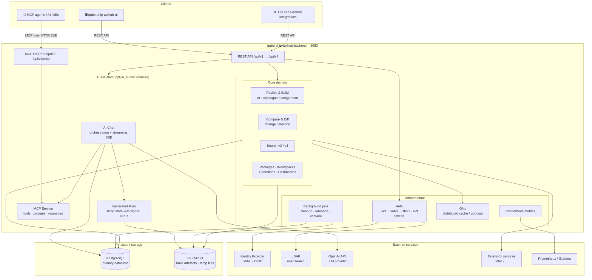

# qubership-apihub-backend

**qubership-apihub-backend** is the main backend microservice of the
[qubership-apihub](https://github.com/Netcracker/qubership-apihub) platform
(also known as API Registry / APIHub).
It implements all core business logic, exposes a REST API consumed by
`qubership-apihub-ui` and external integrations, and hosts the optional
AI assistant feature.

## Architecture overview



## Key capabilities

| Area | Description |
|---|---|
| **API catalogue** | Publish, version, and browse OpenAPI / AsyncAPI / GraphQL specifications |
| **Change detection** | Compare any two versions; generate detailed breaking-change reports |
| **Search** | Full-text and structured search across operations and schemas (v3 / v4 API) |
| **Access control** | Role-based permissions; local users + external IdP (SAML / OIDC) + API tokens |
| **AI assistant** | Streaming chat backed by OpenAI; IDS document generation via MCP tools |
| **MCP endpoint** | Model Context Protocol server exposing APIHub data to AI agents and IDEs |
| **Observability** | Prometheus metrics, structured logging, per-turn correlation IDs |

## Installation

This service is part of the larger **qubership-apihub** application and should be
deployed together with its dependencies (PostgreSQL, optionally S3/MinIO).

Full installation guides (docker-compose and Helm) are at:
[qubership-apihub](https://github.com/Netcracker/qubership-apihub).

For local development and debugging see the [Debug](#debug) section below.

## Build

Run the provided build script from the repository root:

```bash
# Linux / macOS
./build.sh

# Windows
build.cmd
```

## Configuration

Configuration is provided via `config.yaml` (loaded from `basePath` at startup).
For a full reference with descriptions and defaults see
[config.template.yaml](qubership-apihub-service/config.template.yaml).

Notable sections:

| Section | Purpose |
|---|---|
| `database` | PostgreSQL connection |
| `security` | JWT keys, external IdP (SAML / OIDC), LDAP, allowed origins |
| `s3Storage` | Optional S3 / MinIO for build artefacts |
| `olric` | Distributed in-process cache; `local` mode for single-node |
| `ai.chat` | AI assistant kill-switch, OpenAI key/model, retention settings |
| `monitoring` | Prometheus ServiceMonitor toggle |
| `cleanup` | Cron schedules for revision, comparison, and soft-deleted data GC |

## Debug

[Local development principles](./docs/local_development/local_development.md)

## Developer Tools

[Development tools setup](./docs/newcomer_env_setup.md)

## Documentation

Full developer and operator documentation lives in [docs/](./docs/README.md).

## AI agent configuration (APM)

Agent context is split between a **central store** and **this repository**:

| Scope | Location |
|-------|----------|
| Generic skills/rules (Go conventions, planner, …) | [`qubership-apihub-ci/agent-skills`](https://github.com/Netcracker/qubership-apihub-ci/tree/apm_migration/agent-skills) |
| Backend-specific skills/rules | [`agent-skills/`](agent-skills/) in this repo |

Deployed `.cursor/` and `.claude/` trees are **not** committed; run APM after clone:

```bash
# one-time: install APM (see https://microsoft.github.io/apm/)
brew install microsoft/apm/apm   # or: pip install apm-cli

# from the repository root:
apm install --target cursor,claude --legacy-skill-paths
```

This reads root `apm.yml` (CI dependencies + local `agent-skills/`), pins versions in
`apm.lock.yaml`, and deploys into `.cursor/` and `.claude/`. Re-run `apm install` to update.

During migration, CI dependencies may use `#apm_migration`; drop the suffix after the store PR
merges.

