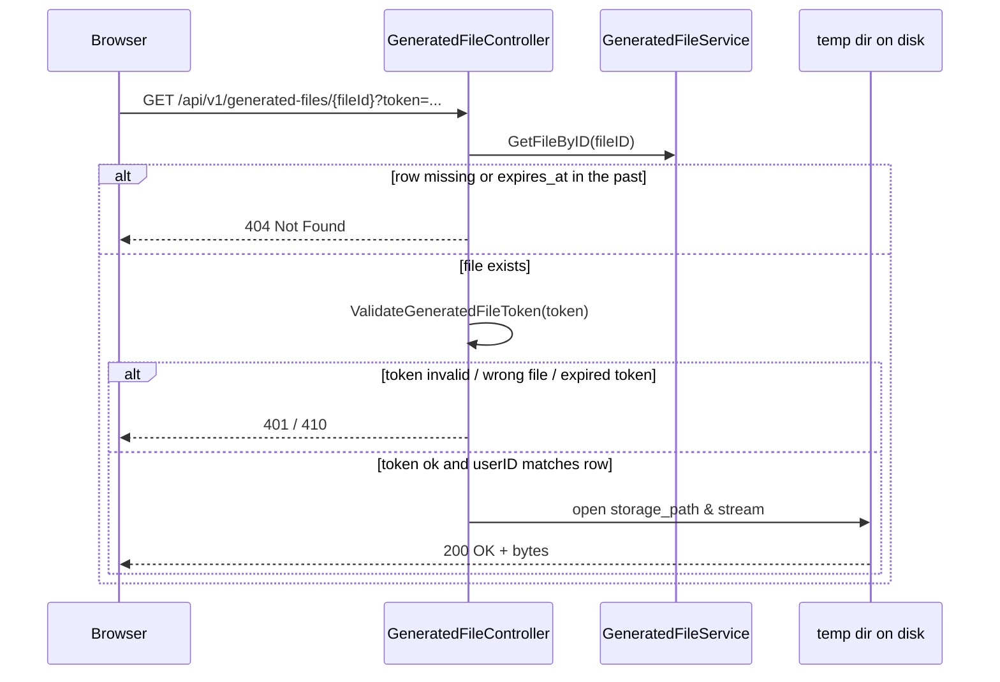

# AI Chat Assistant — Feature Design

Audience: anyone who needs the end-to-end picture of the AI chat feature without walking every source file. Frontend engineers extending the UI, SREs onboarding the feature, backend engineers landing in the area.

Scope: high-level architecture, end-to-end flows, data model, FE↔BE and BE↔LLM contracts, operational concerns. Wire-level details delegate to:

* [docs/api/APIHUB_API.yaml](../../api/APIHUB_API.yaml) — authoritative OpenAPI contract (tag **AI Chat**).
* [ai-chat-frontend-contract.md](./ai-chat-frontend-contract.md) — FE integration guide.
* Migration `qubership-apihub-service/resources/migrations/34_ai_chat.{up,down}.sql` — DDL.

---

## 1. Problem & solution at a glance

The portal needs a productized AI assistant that helps users explore the APIHub catalog and author related artefacts. The PoC version (`/api/v1/ai-chat`, stateless, no UI affordances) is replaced by a full-featured chat with:

* per-user chat ownership; chats are invisible across users;
* durable history in Postgres with a layered retention policy (configurable TTL, "last M forever", unlimited user pins, max 3);
* chat CRUD (list / create / get / rename / pin / unpin / delete);
* live streaming of model responses over SSE with tool-use transparency;
* downloadable files produced by the assistant, served from `/api/v1/generated-files/{fileId}` via short-lived signed tokens;
* automatic context compaction when the conversation approaches the model's context window, so older facts are re-packed into a summary rather than silently dropped;
* portable LLM integration via the industry-standard **Chat Completions** shape (`messages[]` + `tools[]`), so adding another vendor later is a matter of a new `LlmChatService` implementation rather than a rewrite of orchestration logic.

A separate companion feature, the [Integration Design Specification (IDS) generator](./feature-ids-generation-design.md), plugs into this chat via bundled MCP assets and two chat-side tools — see that document for IDS-specific design.

## 2. Architecture overview

```text
                     ┌──────────────────────────────────────┐
                     │              FE (browser)            │
                     │  fetch + ReadableStream SSE parser   │
                     └───────────────┬──────────────────────┘
                                     │ HTTPS  (REST + SSE)
                                     ▼
┌──────────────────────────────────────────────────────────────────────────────┐
│                       qubership-apihub-service (BE)                          │
│                                                                              │
│  controller/AiChatController.go          ── HTTP + SSE (ChatsService +     │
│                                             AiChatService)                   │
│  controller/GeneratedFileController.go   ── /api/v1/generated-files/...    │
│  ──────────────────────────────────────────────────────────────────────────  │
│  service/ChatsService.go                 ── chat/message CRUD only         │
│  service/AiChatService.go                ── turn pipeline, compaction, SSE │
│  service/OpenAIChatService.go            ── LlmChatService → OpenAI        │
│                                             Chat Completions API             │
│  service/MCPService.go                   ── MCP tools + api-packages-list  │
│  service/GeneratedFileService.go         ── temp files + ai_chat_file rows │
│  service/AiChatCleanupService.go         ── retention + file GC jobs       │
│  ──────────────────────────────────────────────────────────────────────────  │
│  repository/AiChatRepositoryPG.go        ── ai_chat / ai_chat_message /    │
│                                             ai_chat_file                     │
│  security/Auth.go, security/GeneratedFileTokens ── RS256 + signed URLs    │
└────────────────────────────┬─────────────────────────────────────────────────┘
                             │
                             ▼  HTTPS (X-Request-ID)
                ┌─────────────────────────────┐         ┌────────────────────┐
                │  OpenAI Chat Completions    │  tools  │  apihub MCP server │
                │  POST /v1/chat/completions  │ ◄─────► │  (in-process MCP)  │
                │  (+ SSE stream)             │         │                    │
                └─────────────────────────────┘         └────────────────────┘
```

Responsibilities:

* `AiChatController` — HTTP/SSE adapter. Chat CRUD/list delegates to `ChatsService`; send-message endpoints delegate to `AiChatService`.
* `GeneratedFileController` — token-authenticated file downloads. Validates file row (and expiration) **before** the JWT, then checks token ownership.
* `ChatsService` — pure persistence for chats and message history (`ListChats`, `CreateChat`, `GetChat`, `UpdateChat`, `DeleteChat`, `ListMessages`). No LLM awareness.
* `AiChatService` — owns the **turn pipeline**: idempotency, history load, compaction, tool loop orchestration, SSE framing, auto-title, metrics. Calls `LlmChatService` for each model round-trip and `MCPService` for tool execution.
* `OpenAIChatService` — the sole `LlmChatService` implementation today. Translates `LLMRequest` / `LLMResponse` to OpenAI's Chat Completions API (streaming and non-streaming). Stateless: every call receives the full `messages[]` slice built by `AiChatService`.
* `MCPService` — catalogs MCP tools (`search_api_operations`, `get_api_operation_specification`, `get_api_operation_diff`, `get_document`) and bundled assets under `resources/mcp/`. Used by the in-process tool loop and by the public MCP HTTP server (`/api/v2/mcp`).
* `GeneratedFileService` — writes LLM-produced files to per-user temp directories and registers rows in `ai_chat_file`.
* `AiChatCleanupService` — periodic chat retention and generated-file GC, with distributed locks.

Entity → view converters (`MakeAiChatView`, `MakeAiChatMessageView`) live in `entity/` next to the structs, with no service dependencies.

## 3. Data model (Postgres)

Three tables, created by migration `34_ai_chat.up.sql`:

| Table | Purpose | Key columns |
| --- | --- | --- |
| `ai_chat` | one row per chat | `id`, `user_id`, `title`, `pinned`, `created_at`, `last_message_at`, `messages_count`, `compaction_summary`, `compacted_up_to_created_at`, `last_turn_tokens` |
| `ai_chat_message` | one row per message | `id`, `chat_id`, `role` (`user` / `assistant`), `content`, `tool_invocations` (jsonb), `client_message_id` (partial unique index), `created_at` |
| `ai_chat_file` | one row per generated file | `id`, `chat_id?`, `message_id?`, `user_id`, `filename`, `storage_path`, `mime_type`, `size_bytes`, `created_at`, `expires_at` |

There are **no** OpenAI-specific columns (`openai_previous_response_id`, `openai_response_id` were removed — conversation state is reconstructed from stored messages + compaction summary on every turn).

Invariants:

* Every read is scoped with `WHERE user_id = ?`.
* `last_message_at` is always populated (equals `created_at` for empty chats).
* `client_message_id` partial unique index `(chat_id, client_message_id) WHERE client_message_id IS NOT NULL` drives idempotency.

## 4. End-to-end flows

### 4.1 Streaming "send message"

```mermaid
sequenceDiagram
    participant FE
    participant Ctrl as AiChatController
    participant Svc as AiChatService
    participant LLM as OpenAIChatService
    participant MCP as MCPService
    participant OAI as OpenAI Chat Completions

    FE->>Ctrl: POST /chats/{id}/messages/stream<br/>{ content, clientMessageId }
    Ctrl->>Svc: SendMessageStream(userID, chatID, req)
    Svc->>Svc: idempotency check on (chat_id, client_message_id)
    alt cached pair exists
        Svc-->>Ctrl: stream replays cached assistant message
    else fresh turn
        Svc->>Svc: persist user message
        Svc->>Svc: load history; maybeCompactBefore(...)
        opt compaction fired
            Svc-->>FE: SSE context.compacted
        end
        Svc-->>FE: SSE message.assistant.start
        Svc->>Svc: runToolLoop(history, streaming hooks)
        loop tool loop (≤ 10 iterations)
            Svc->>LLM: ExecuteStreaming(LLMRequest{system, messages, tools})
            LLM->>OAI: POST /v1/chat/completions (stream)
            OAI-->>LLM: content deltas + tool_call fragments
            LLM-->>FE: hooks.OnTextDelta → SSE message.assistant.delta
            LLM-->>FE: hooks.OnToolStart → SSE tool.started
            alt model issued tool calls
                Svc->>MCP: ExecuteSearchTool / ExecuteGetSpecTool / ...
                MCP-->>Svc: tool result JSON
                Svc-->>FE: hooks.OnToolCompleted → SSE tool.completed
                Svc->>Svc: append assistant+tool messages to slice
            else final text
                note over Svc: loop exits
            end
        end
        Svc->>Svc: persist assistant message; update chat (LastMsgAt, tokens)
        Svc-->>FE: SSE message.assistant.completed { full AiChatMessage }
        Svc-->>FE: SSE done
    end
```

Key invariants:

* The user message is persisted **before** the first SSE frame. Validation/auth errors are HTTP 4xx with no stream.
* `message.assistant.start` is emitted **before** the LLM call.
* `tool.started` fires when the model commits to a tool call (streaming: as soon as `tool_call` id + name are known).
* On error after the stream started: one `error` SSE frame, no `done`.

### 4.2 Loading existing chat history

```mermaid
sequenceDiagram
    participant FE
    participant Ctrl as AiChatController
    participant Chats as ChatsService
    participant Repo as AiChatRepositoryPG

    FE->>Ctrl: GET /chats?limit=100
    Ctrl->>Chats: ListChats(userID, before?, limit)
    Chats->>Repo: SELECT ... ORDER BY pinned DESC, last_message_at DESC
    Chats-->>Ctrl: { chats[], hasMore }

    FE->>Ctrl: GET /chats/{id}/messages?limit=100
    Ctrl->>Chats: ListMessages(userID, chatID, before?, limit)
    Chats->>Repo: SELECT ... ORDER BY created_at DESC
    note right of Chats: content returned as stored;<br/>file links are not re-signed
    Chats-->>Ctrl: { messages[], hasMore }
```

Pagination is keyset by RFC 3339 timestamps. Assistant messages containing generated-file Markdown links are returned **verbatim** from the database — the server does not re-mint download tokens on `ListMessages`.

### 4.3 Generated file download



The download endpoint does not require a session cookie — the signed query token authorises the request. Checking file existence **before** token validation ensures expired or GC'd files surface as **404** instead of a confusing **401**.

## 5. FE↔BE contract

Fully documented in [ai-chat-frontend-contract.md](./ai-chat-frontend-contract.md). Summary:

* Chat management under `/api/v1/ai-chat/*` with session JWT.
* `POST /messages/stream` is the main UX path (`text/event-stream`).
* SSE events: `context.compacted` (optional), `message.assistant.start`, `tool.started` / `tool.completed`, `message.assistant.delta`, `message.assistant.completed`, `done` or `error`.
* Optional `clientMessageId` for idempotent retries.
* Shared constants (not in API): `MAX_PINNED_PER_USER = 3`, `MAX_USER_MESSAGE_LENGTH = 32000`.

## 6. BE↔LLM contract

The backend uses **OpenAI Chat Completions** (`POST /v1/chat/completions`) via the `LlmChatService` interface. The same message/tool shape is the de-facto standard across vendors, which keeps orchestration in `AiChatService` vendor-agnostic.

### 6.1 `LlmChatService` interface

```text
Execute(ctx, LLMRequest) → LLMResponse
ExecuteStreaming(ctx, LLMRequest, onDelta, onToolStart) → LLMResponse
ContextWindowSize() → int
```

`LLMRequest` carries:

* `SystemMessage` — static instructions + optional `api-packages-list` injection;
* `Messages[]` — full conversation for this round-trip (user / assistant / tool roles; assistant messages may include `ToolCalls`; tool results use `role=tool` + `ToolCallID`);
* `Tools[]` — MCP tool descriptors for the model.

`LLMResponse` carries assistant text, optional `ToolCalls`, and token `Usage`. There is no continuation token — state lives in Postgres, not on the provider.

### 6.2 Tool loop (`AiChatService.runToolLoop`)

```text
messages := history from DB (+ compaction summary as system message)
loop (max 10):
  resp = llm.Execute[Streaming]({ system, messages, tools })
  if no tool calls: return accumulated text
  if ask_clarification: append question as final text; return
  append assistant message with tool_calls to messages
  execute tools locally (MCP + IDS handlers)
  append one tool message per tool_call_id
```

Each iteration is one Chat Completions request with the **entire** `messages` slice built so far. After compaction, older verbatim messages are dropped and replaced by `compaction_summary`.

### 6.3 Context compaction

`AiChatService.maybeCompactBefore` at the start of each turn:

* if `chat.last_turn_tokens >= ctx_window * compactAtContextPercent / 100` (default 80%) and history has more than 8 messages …
* … summarize the head (`history[:-8]`) via a one-shot `llm.Execute` (no tools);
* … persist `compaction_summary` and `compacted_up_to_created_at`; reset `last_turn_tokens`.

SSE `context.compacted` payload (see OpenAPI `AiChatStreamContextCompactedEvent`):

| Field | Meaning |
| --- | --- |
| `compactedUpTo` | boundary timestamp (RFC3339) |
| `summaryPreview` | truncated preview of the summary (fixed rune limit) |
| `messagesBefore` | message count before compaction |
| `messagesKeptRaw` | trailing messages kept verbatim (8) |

Approximate compacted count: `messagesBefore - messagesKeptRaw`.

### 6.4 One-shot LLM calls

Auto-title and compaction summarisation use the same `LlmChatService.Execute` with a small system prompt and a single user message — no tools, no persistence on the provider side.

### 6.5 Observability

* Per-turn correlation UUID in `context.Context` → `X-Request-ID` on every OpenAI HTTP call.
* `WithAiChatTurn(ctx, userID, chatID)` for tool handlers (`save_generated_file` reads owner from context).
* Prometheus metrics in `metrics/ai_chat.go` (turns, duration, tokens, compactions, tool calls, generated files).

## 7. Operational concerns

### 7.1 Feature flag

`ai.chat.enabled` gates routes, retention job, and file GC. Default `false` in `config.template.yaml`. Requires OpenAI API key, writable temp directory, and migration `34_ai_chat`.

### 7.2 Retention

`AiChatCleanupService`: delete old non-pinned chats past `retentionDays` (keeping `pinnedForeverCount` recent ones); GC expired `ai_chat_file` rows and disk files on a cron schedule. Distributed lock per job.

### 7.3 Idempotency

Same three cases as before: fresh insert, replay-completed (return cached pair / replay SSE), replay-incomplete (retry LLM after user message persisted).

### 7.4 Security

* User-scoped repository reads.
* File download tokens: RS256 via existing `security` keeper; TTL aligned with `expires_at`.
* Download: file row check → token validation → `userID` must match row owner.

## 8. References

* OpenAPI: `docs/api/APIHUB_API.yaml`, tag `AI Chat`.
* FE integration: [ai-chat-frontend-contract.md](./ai-chat-frontend-contract.md).
* Companion: [IDS generation](./feature-ids-generation-design.md).
* Code entry points: `Service.go` (wiring), `service/ChatsService.go`, `service/AiChatService.go`, `service/OpenAIChatService.go`, `service/LlmChatService.go`.
