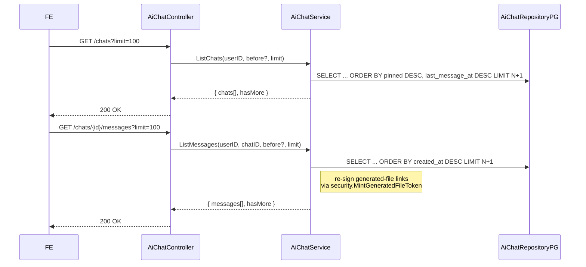
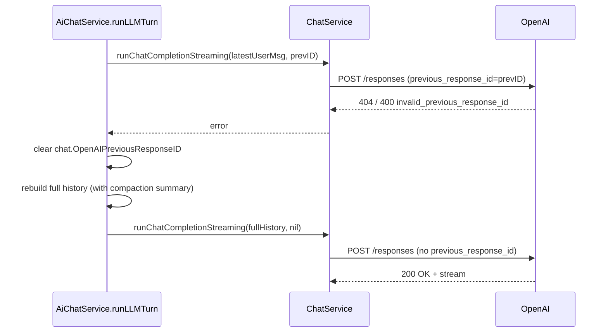

# AI Chat Assistant — Feature Design

Audience: anyone who needs the end-to-end picture of the AI chat feature without reading the full implementation plan or walking the code. Frontend engineers extending the UI, SREs onboarding the feature, BE engineers landing in the area.

Scope: high-level architecture, end-to-end flows, data model, FE↔BE and BE↔LLM contracts, operational concerns. Wire-level details intentionally delegate to the dedicated documents:

* [docs/api/APIHUB_API.yaml](../../api/APIHUB_API.yaml) — authoritative OpenAPI contract (tag **AI Chat**).
* [docs/ai-chat-frontend-contract.md](./ai-chat-frontend-contract.md) — FE integration guide for the contract.
* [docs/ai-chat-backend-implementation-plan.md](./ai-chat-backend-implementation-plan.md) — backend implementation plan (DB schema, package layout, migrations, etc.).

---

## 1. Problem & solution at a glance

The portal needs a productized AI assistant that helps users explore the APIHub catalog and author related artefacts. The PoC version (`/api/v1/ai-chat`, stateless, no UI affordances) is replaced by a full-featured chat with:

* per-user chat ownership; chats are invisible across users;
* durable history in Postgres with a layered retention policy (configurable TTL, "last M forever", unlimited user pins, max 3);
* chat CRUD (list / create / get / rename / pin / unpin / delete);
* live streaming of model responses over SSE with tool-use transparency;
* downloadable files produced by the assistant, served from a generic `/api/v1/generated-files/{fileId}` endpoint via short-lived signed tokens;
* automatic context compaction when the conversation approaches the model's context window, so that old facts are re-packed into a summary rather than silently dropped by the LLM;
* minimal traffic on both the FE↔BE and BE↔OpenAI hops.

A separate companion feature, the [Integration Design Specification (IDS) generator](./feature-ids-generation-design.md), plugs into this chat by adding two MCP-side assets and two chat-side tools — see that document for the IDS-specific design.

## 2. Architecture overview

```text
                     ┌──────────────────────────────────────┐
                     │              FE (browser)            │
                     │  fetch + ReadableStream SSE parser   │
                     └───────────────┬──────────────────────┘
                                     │ HTTPS  (REST + SSE)
                                     ▼
┌──────────────────────────────────────────────────────────────────────────────┐
│                       qubership-apihub-service (BE)                          │
│                                                                              │
│  controller/AiChatController.go                ── HTTP + SSE plumbing        │
│  controller/GeneratedFileController.go         ── /api/v1/generated-files/.. │
│  ──────────────────────────────────────────────────────────────────────────  │
│  service/ai_chat_service.go    (AiChatService) ── chats/messages orchestrator│
│  service/ChatService.go        (ChatService)   ── OpenAI Responses API loop  │
│  service/MCPService.go         (MCPService)    ── apihub MCP tools+resources │
│  service/GeneratedFileService.go               ── /tmp file storage          │
│  service/AiChatCleanupService.go               ── retention + GC jobs        │
│  ──────────────────────────────────────────────────────────────────────────  │
│  repository/AiChatRepositoryPG.go              ── ai_chat / ai_chat_message  │
│                                                   / ai_chat_file tables      │
│  security/Auth.go, security/GeneratedFileTokens── RS256 IdP + signed file URLs│
└────────────────────────────┬─────────────────────────────────────────────────┘
                             │
                             ▼  HTTPS (X-Request-ID)
                ┌─────────────────────────────┐         ┌────────────────────┐
                │  OpenAI Responses API       │  tools  │  apihub MCP server │
                │  /v1/responses (+ stream)   │ ◄─────► │  (in-process MCP)  │
                └─────────────────────────────┘         └────────────────────┘
```

Responsibilities split, top to bottom:

* `AiChatController` — HTTP/SSE adapter only. Parses requests, enforces auth, maps service errors to status codes, frames SSE events.
* `GeneratedFileController` — single token-authenticated endpoint for downloads; deliberately not chat-scoped (the token is the auth) so future non-chat features can reuse it.
* `AiChatService` — owns chat/message persistence and the *turn pipeline*: idempotency, history loading, compaction, streaming, retries against transient OpenAI failures.
* `ChatService` — the LLM-facing layer. Speaks the OpenAI Responses API end-to-end: builds the request, drives the `function_call` loop against MCP tools, fans tool lifecycle / text deltas back to `AiChatService` via hooks. Stays user-agnostic.
* `MCPService` — catalogs MCP tools (`search_rest_api_operations`, `get_rest_api_operations_specification`, `get_rest_api_operation_diff`) and bundled assets (template/prompt files under `resources/mcp/`). Used both by the in-process chat tool loop and by the public MCP HTTP server (`/api/v2/mcp`).
* `GeneratedFileService` — writes LLM-produced files to per-user `/tmp` directories and registers them in `ai_chat_file`.
* `AiChatCleanupService` — periodic retention job (chats) + temp-file GC (generated files), driven by config-defined cron schedules and a distributed lock.

## 3. Data model (Postgres)

Three new tables, all created by migration `34_ai_chat.up.sql`:

| Table | Purpose | Key columns |
| --- | --- | --- |
| `ai_chat` | one row per chat | `id`, `user_id`, `title`, `pinned`, `created_at`, `last_message_at`, `messages_count`, `openai_previous_response_id`, `compaction_summary`, `compacted_up_to_created_at`, `last_turn_tokens` |
| `ai_chat_message` | one row per message in chronological order | `id`, `chat_id`, `role` (`user` / `assistant`), `content`, `tool_invocations` (jsonb), `openai_response_id`, `client_message_id` (with partial unique index for idempotency), `created_at` |
| `ai_chat_file` | one row per generated file | `id`, `chat_id?`, `message_id?`, `user_id`, `filename`, `storage_path`, `mime_type`, `size_bytes`, `created_at`, `expires_at` |

The full DDL is in `docs/ai-chat-backend-implementation-plan.md` §2 and the up/down migration files. Important invariants:

* `ai_chat.user_id` is the only column that ties a chat to its owner — every read is scoped through `WHERE user_id = ?`. The repository never exposes a `GetChatByID` without a userID.
* `last_message_at` is always populated (equals `created_at` for empty chats), so `ORDER BY pinned DESC, last_message_at DESC` works uniformly for the list endpoint.
* `client_message_id` has a partial unique index (`WHERE client_message_id IS NOT NULL`) which is the engine of idempotency.

## 4. End-to-end flows

### 4.1 Streaming "send message"

This is the central path. Every other endpoint is plumbing around it.

```mermaid
sequenceDiagram
    participant FE
    participant Ctrl as AiChatController
    participant Svc as AiChatService
    participant Chat as ChatService
    participant MCP as MCPService
    participant OAI as OpenAI Responses API

    FE->>Ctrl: POST /chats/{id}/messages/stream<br/>{ content, clientMessageId }
    Ctrl->>Svc: SendMessageStream(userID, chatID, req)
    Svc->>Svc: idempotency check on (chat_id, client_message_id)
    alt cached pair exists
        Svc-->>Ctrl: stream replays cached assistant message
    else fresh turn
        Svc->>Svc: persist user message
        Svc->>Svc: load history; maybeCompactBefore(...)
        opt compaction fired
            Svc-->>FE: SSE context.compacted
        end
        Svc-->>FE: SSE message.assistant.start
        Svc->>Chat: runChatCompletionStreaming(history, prevResponseID, hooks)
        loop tool-call loop (≤ 10 iterations)
            Chat->>OAI: Responses.NewStreaming(req)
            OAI-->>Chat: response.output_text.delta * N
            Chat-->>FE: hooks.OnTextDelta → SSE message.assistant.delta
            OAI-->>Chat: response.output_item.added (function_call)
            Chat-->>FE: hooks.OnToolStart → SSE tool.started
            OAI-->>Chat: response.output_item.done (function_call args)
            Chat->>MCP: ExecuteSearchTool / ExecuteGetSpecTool / ...
            MCP-->>Chat: tool result JSON
            Chat-->>FE: hooks.OnToolCompleted → SSE tool.completed
            Chat->>OAI: Responses.NewStreaming(function_call_output, prev_response_id)
            note right of Chat: terminate when iteration has no function_call items
        end
        Chat-->>Svc: chatTurnResult { content, usage, prevResponseID }
        Svc->>Svc: persist assistant message; update chat (LastMsgAt, prevResponseID, tokens)
        Svc-->>FE: SSE message.assistant.completed { full AiChatMessage }
        Svc-->>FE: SSE done
    end
```

Key invariants of the streaming flow:

* The user message is persisted **before** the first SSE frame is emitted. Validation/auth errors come back as regular HTTP 4xx with no stream.
* `message.assistant.start` is emitted **before** the OpenAI call, so the FE can render an "assistant is thinking…" placeholder within milliseconds.
* `tool.started` is fired on `response.output_item.added` (the moment the model commits to a tool call), not on `*.done` — UX win: pills appear within ~100 ms instead of after argument streaming completes.
* On non-recoverable error after the stream began, a single `error` SSE frame is sent and the channel is closed; no `done` follows.

### 4.2 Loading existing chat history



Pagination is **keyset by RFC 3339 timestamps**, not numeric pages — the FE always passes `before = <oldest createdAt from previous page>`. This is robust against the live nature of the data (new messages arrive, chats float to the top of the list on activity).

When the FE re-renders an old assistant message that contains generated-file Markdown links, the BE re-mints fresh `?token=...` query strings in place: stale tokens are not surfaced to the user as long as the underlying file hasn't been GC'd.

### 4.3 Generated file download

```mermaid
sequenceDiagram
    participant Browser
    participant Ctrl as GeneratedFileController
    participant Svc as AiChatService
    participant FS as /tmp on disk

    Browser->>Ctrl: GET /api/v1/generated-files/{fileId}?token=...
    Ctrl->>Ctrl: validate token (security.VerifyGeneratedFileToken)
    Ctrl->>Svc: GetFileForUser(fileID, userID)
    Svc->>Svc: read row from ai_chat_file; check expires_at
    Svc-->>Ctrl: row + storage path
    Ctrl->>FS: open & stream
    FS-->>Browser: 200 OK + bytes
    note right of Browser: 410 if token expired; 404 if file GC'd
```

The download endpoint **does not** require a session cookie or `Authorization` header — the short-lived signed query token is the entire authorization story. This makes the link work in a new tab, in `download` attributes, etc., for the duration of its TTL.

## 5. FE↔BE contract

The contract is fully documented in [`docs/ai-chat-frontend-contract.md`](./ai-chat-frontend-contract.md). The 30-second tour:

* All chat-management endpoints live under `/api/v1/ai-chat/*` and require the standard APIHUB session JWT/cookie.
* Two POST endpoints can produce assistant messages:
  * `POST /messages` — non-streaming, kept for tests and scripts;
  * `POST /messages/stream` — the main UX path, `text/event-stream`.
* The streaming endpoint emits a fixed sequence of typed SSE events: `context.compacted` (optional), `message.assistant.start`, zero or more `tool.started`/`tool.completed` and `message.assistant.delta`, then `message.assistant.completed` and `done` (or a single `error`).
* All chat-changing endpoints accept an optional `clientMessageId` (UUID) for idempotent retries; resending the same key returns the cached pair instead of billing another LLM call.
* Two values that affect the UI are deliberately **constants shared by code, not by API**: `MAX_PINNED_PER_USER = 3` and `MAX_USER_MESSAGE_LENGTH = 32000`. There is no `/config` endpoint to fetch them.

## 6. BE↔LLM contract

OpenAI's Responses API is used (not Chat Completions) for two reasons:

1. **Cheap multi-turn:** the API stores conversation state on the server-side and lets us reference it by `previous_response_id`. After the first turn we only send the latest user message.
2. **First-class tool calls:** the streaming protocol exposes per-iteration `function_call` items with `call_id` correlation, which makes the live `tool.started`/`tool.completed` UI affordances trivial.

### 6.1 Request shape

For the first turn (or right after a compaction), the request includes:

* `instructions`: the static system prompt (`systemMessageBaseContent`) plus, when an MCP workspace is configured, an injection of the cached `api-packages-list` resource so the model knows what packages exist;
* `input`: the full compacted conversation as `EasyInputMessageParam` items;
* `tools`: the catalog returned by `MCPService.MakeOpenAiMCPTools()` (apihub MCP tools, plus IDS tools when the bundled assets are present);
* `previous_response_id`: omitted.

For subsequent turns:

* `instructions`: same;
* `input`: just the latest user message (or just the `function_call_output` items, while a tool loop is in flight);
* `previous_response_id`: the ID stored on the chat row from the previous turn / iteration.

### 6.2 Tool loop

Both `runChatCompletionWithHistory` (sync) and `runChatCompletionStreaming` (SSE) implement the same loop:

```text
do
  response = OpenAI.Responses.{New|NewStreaming}(req)
  for output in response:
    if output.type == "message":            collect text
    elif output.type == "function_call":    enqueue tool call
  if no function_calls:                     final turn → return
  results = MCPService.Execute*(toolCall)   # or chat-side IDS tools
  req.input = function_call_output[*]
  req.previous_response_id = response.id
while iteration < 10
```

If any iteration returns no function calls, the loop exits with the accumulated `chatTurnResult` (assistant text, usage, list of tool invocations, final response ID).

### 6.3 Recovery from stale `previous_response_id`

OpenAI does not retain response state forever. If a chat sits idle long enough (or the API key rotates between projects) the stored response is evicted; the next turn fails with HTTP 404 / 400 referencing `param=previous_response_id`. `IsInvalidPrevResponseIDError` detects this:



The retry happens once. Any subsequent error bubbles up to the client.

### 6.4 Context compaction

`AiChatService.maybeCompactBefore` runs at the start of every turn:

* if `chat.last_turn_tokens >= ctx_window * compactAtContextPercent / 100` (default 80%) and the history has more than 8 messages …
* … take the older slice (`history[:-8]`), call `summarizeMessagesForCompaction` against the model with `Store=false` (so the summarisation request itself never enters the user-visible Responses chain) …
* … and store the result as `chat.compaction_summary` plus `chat.compacted_up_to_created_at` (boundary). `chat.openai_previous_response_id` is reset to `NULL` so the next request re-uploads the new compacted view.

A `context.compacted` SSE frame is emitted to the FE so the UI can show a "(earlier conversation summarised)" hint.

### 6.5 Observability

* Every LLM turn mints a fresh UUID and attaches it to `context.Context` via `WithAiChatCorrelationID`.
  `openAIRequestOptions(ctx)` pulls it back and adds `X-Request-ID: <uuid>` to **every** OpenAI request fired
  during the turn (including the title/summary side-quests). OpenAI echoes the header in its server-side traces,
  so support can pivot from one of our log lines to the upstream provider's request graph in a single click.
* `runLLMTurn` also attaches `WithAiChatTurn(ctx, userID, chat.ID)` so MCP tool handlers running inside the loop know whose turn this is — `save_generated_file` reads it back to anchor the output to the right per-user `/tmp` directory without taking userID as a tool argument.
* Prometheus metrics live in `metrics/ai_chat.go`:
  * `ai_chat_turns_total{mode,status}`, `ai_chat_turn_duration_seconds{mode,status}` — turn-level RED;
  * `ai_chat_turn_tokens{mode}` — usage histogram;
  * `ai_chat_compactions_total`, `ai_chat_tool_calls_total{tool,status}`;
  * `ai_chat_generated_files_total`, `ai_chat_generated_file_bytes`.

## 7. Operational concerns

### 7.1 Feature flag

A single master kill-switch — `ai.chat.enabled` — gates everything: the registration of `/api/v1/ai-chat/*` and
`/api/v1/generated-files/*` routes, the AI chat retention job, and the generated-files GC job.
`Service.go::isAiChatEnabled` is the single source of truth. Default is `false` in `config.template.yaml` so every
deployment must opt in deliberately (the feature requires an OpenAI API key, writable temp directory, and the
`34_ai_chat` migration to be applied).

### 7.2 Retention

Implemented in `service/AiChatCleanupService.go`:

* Chats older than `ai.chat.retentionDays` are deleted, **except** the most recently active `ai.chat.pinnedForeverCount` chats per user (kept indefinitely as a server-side quality-of-life policy) and any chat with `pinned = true`.
* Generated files are deleted from disk and `ai_chat_file` rows expire on `ai.chat.generatedFiles.cleanupSchedule` (default every 5 minutes).
* Both jobs hold a distributed lock via `LockService` so a multi-replica deployment runs them at most once per cluster.

### 7.3 Idempotency contract

Take a `clientMessageId` (UUID) from the FE on every `POST /messages*` call. The repository inserts the user message under a partial unique index `(chat_id, client_message_id) WHERE client_message_id IS NOT NULL`. Three cases at the start of a turn:

1. **Fresh** — no existing user message with this ID. Insert and run a fresh LLM turn.
2. **Replay-completed** — user message exists *and* a later assistant message exists. Return the cached pair; for streaming, replay the assistant message as `message.assistant.*` events so the FE sees the same shape as a real turn.
3. **Replay-incomplete** — user message exists but no assistant message follows (a previous attempt errored out after persisting the user message). Re-run the LLM call so the client gets a complete pair instead of a hard 500 on retry.

Concurrent inserters with the same ID race on the partial unique index; the loser falls into case 2 or 3 above.

### 7.4 Security

* User-scoped reads — every repository call is `WHERE user_id = ?`. There is no `GetChatByID` without a userID.
* Generated-file URLs are RS256 JWTs signed with the keys from `security/Auth.go::keeper` (the same IdP that signs portal access tokens). No new secret material is introduced.
* Token TTL is anchored to the file's `expires_at`; both are propagated through `GeneratedFileService.SaveFile`.
* `GeneratedFileController` performs `(userID, fileID)` ownership recheck on every download, even after the JWT validates — defence in depth.

## 8. References

* OpenAPI: `docs/api/APIHUB_API.yaml`, tag `AI Chat`.
* FE integration: `docs/ai-chat-frontend-contract.md`.
* BE implementation plan (DB schema, migrations, package layout, config keys): `docs/ai-chat-backend-implementation-plan.md`.
* Companion feature design: [Integration Design Specification (IDS) generation](./feature-ids-generation-design.md).
* Code entry points: `qubership-apihub-service/Service.go::NewServiceContainer`, `service/ai_chat_service.go`, `service/ChatService.go`.
