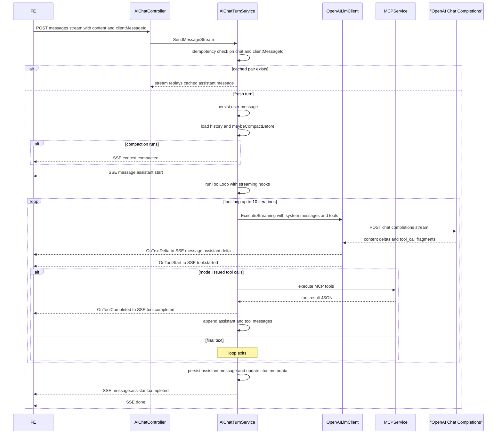
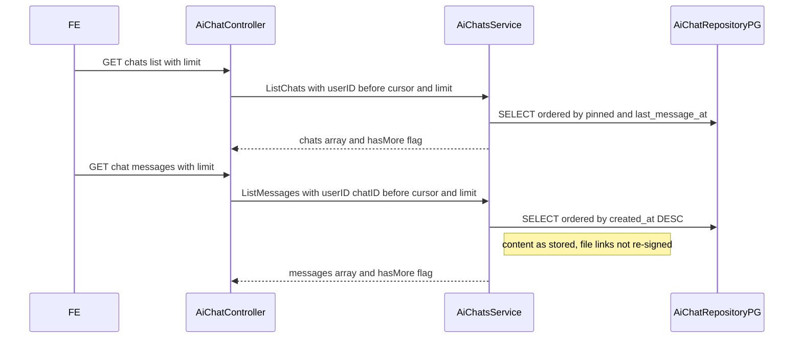
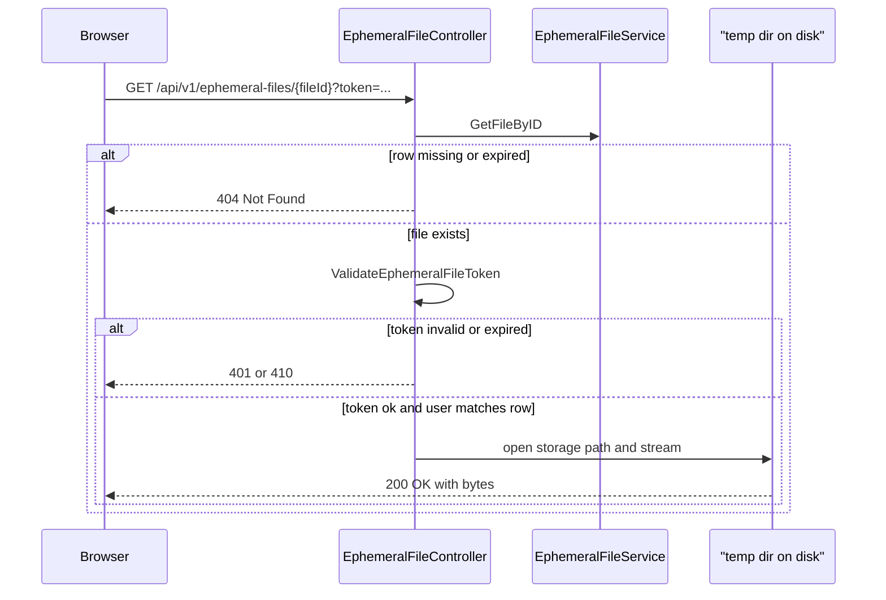

# AI Chat Assistant — Feature Design

Audience: anyone who needs the end-to-end picture of the AI chat feature without walking every source file.
Frontend engineers extending the UI, SREs onboarding the feature, backend engineers landing in the area.

Scope: high-level architecture, end-to-end flows, data model, FE↔BE and BE↔LLM contracts, operational
concerns. Wire-level details delegate to:

* [docs/api/APIHUB_API.yaml](../../api/APIHUB_API.yaml) — authoritative OpenAPI contract (tag **AI Chat**).
* [ai-chat-frontend-contract.md](./ai-chat-frontend-contract.md) — FE integration guide.
* Migration `qubership-apihub-service/resources/migrations/34_ai_chat.{up,down}.sql` — DDL.

---

## 1. Problem & solution at a glance

The portal needs a productized AI assistant that helps users explore the APIHub catalog and author related
artefacts. The PoC version (`/api/v1/ai-chat`, stateless, no UI affordances) is replaced by a full-featured
chat with:

* per-user chat ownership; chats are invisible across users;
* durable history in Postgres with a layered retention policy (configurable TTL, "last M forever",
  unlimited user pins, max 3);
* chat CRUD (list / create / get / rename / pin / unpin / delete);
* live streaming of model responses over SSE with tool-use transparency;
* downloadable files produced by the assistant, served from `/api/v1/ephemeral-files/{fileId}` via
  short-lived signed tokens;
* automatic context compaction when the conversation approaches the model's context window;
* portable LLM integration via the industry-standard **Chat Completions** shape (`messages[]` + `tools[]`),
  so adding another vendor later is a matter of a new `LlmClient` implementation.

A separate companion feature, the [Integration Design Specification (IDS) generator](./feature-ids-generation-design.md),
plugs into this chat via bundled MCP assets and two chat-side tools.

## 2. Architecture overview

```text
                     ┌──────────────────────────────────────┐
                     │              FE (browser)            │
                     │  fetch + ReadableStream SSE parser   │
                     └───────────────┬──────────────────────┘
                                     │ HTTPS  (REST + SSE)
                                     ▼
┌──────────────────────────────────────────────────────────────────────────────┐
│                       qubership-apihub-service (BE)                          │
│                                                                              │
│  controller/AiChatController.go          ── HTTP + SSE (AiChatsService +   │
│                                             AiChatTurnService)               │
│  controller/EphemeralFileController.go   ── /api/v1/ephemeral-files/...    │
│  ──────────────────────────────────────────────────────────────────────────  │
│  service/AiChatsService.go               ── chat/message CRUD only         │
│  service/AiChatTurnService.go            ── turn pipeline, compaction, SSE │
│  client/OpenAIClient.go                  ── LlmClient → OpenAI             │
│                                             Chat Completions API             │
│  service/MCPService.go                   ── MCP tools + api-packages-list  │
│  service/EphemeralFileService.go         ── temp files + ephemeral_file    │
│  service/ChatCleanupService.go           ── chat retention job             │
│  service/EphemeralFileCleanupService.go  ── ephemeral file GC job          │
│  ──────────────────────────────────────────────────────────────────────────  │
│  repository/AiChatRepositoryPG.go        ── ai_chat / ai_chat_message       │
│  repository/EphemeralFileRepository.go   ── ephemeral_file                   │
│  security/EphemeralFileTokens.go         ── RS256 signed download tokens   │
└────────────────────────────┬─────────────────────────────────────────────────┘
                             │
                             ▼  HTTPS (X-Request-ID)
                ┌─────────────────────────────┐         ┌────────────────────┐
                │  OpenAI Chat Completions    │  tools  │  apihub MCP server │
                │  POST /v1/chat/completions  │ ◄─────► │  (in-process MCP)  │
                │  (+ SSE stream)             │         │                    │
                └─────────────────────────────┘         └────────────────────┘
```

Responsibilities:

* `AiChatController` — HTTP/SSE adapter. Chat CRUD/list delegates to `AiChatsService`; send-message
  endpoints delegate to `AiChatTurnService`.
* `EphemeralFileController` — token-authenticated file downloads. Validates file row (and expiration)
  **before** the JWT, then checks token ownership.
* `AiChatsService` — pure persistence for chats and message history (`ListChats`, `CreateChat`, `GetChat`,
  `UpdateChat`, `DeleteChat`, `ListMessages`). No LLM awareness.
* `AiChatTurnService` — owns the **turn pipeline**: idempotency, history load, compaction, tool loop
  orchestration, SSE framing, auto-title, metrics. Calls `LlmClient` for each model round-trip and
  `MCPService` for tool execution.
* `OpenAILlmClient` (`client/OpenAIClient.go`) — the sole `LlmClient` implementation today. Translates
  `LLMRequest` / `LLMResponse` (defined in `client/LlmClient.go`) to OpenAI's Chat Completions API.
  Constructed from `config.OpenAIConfig`. Stateless: every call receives the full `messages[]` slice.
* `MCPService` — catalogs MCP tools and bundled assets under `resources/mcp/`. Used by the in-process
  tool loop and by the public MCP HTTP server (`/api/v2/mcp`).
* `EphemeralFileService` — writes LLM-produced files to per-user temp directories and registers rows in
  `ephemeral_file`. Chat-agnostic: no `chat_id` / `message_id` coupling.
* `ChatCleanupService` — periodic chat retention (TTL + last-N + pinned protection), with distributed lock.
* `EphemeralFileCleanupService` — periodic GC of expired `ephemeral_file` rows and disk files.

Entity → view converters (`MakeAiChatView`, `MakeAiChatMessageView`) live in `entity/` next to the structs,
with no service dependencies.

## 3. Data model (Postgres)

Three tables, created by migration `34_ai_chat.up.sql`:

| Table | Purpose | Key columns |
| --- | --- | --- |
| `ai_chat` | one row per chat | `id`, `user_id`, `title`, `pinned`, `created_at`, `last_message_at`, `messages_count`, `compaction_summary`, `compacted_up_to_created_at`, `last_turn_tokens` |
| `ai_chat_message` | one row per message | `id`, `chat_id`, `role` (`user` / `assistant`), `content`, `tool_invocations` (jsonb), `client_message_id` (partial unique index), `created_at` |
| `ephemeral_file` | one row per temporary file | `id`, `user_id`, `filename`, `storage_path`, `mime_type`, `size_bytes`, `created_at`, `expires_at` |

There are **no** OpenAI-specific columns. Conversation state is reconstructed from stored messages plus
compaction summary on every turn. `ephemeral_file` has no `chat_id`/`message_id` — it is a standalone
table that could serve any use-case requiring short-lived server-side file storage.

Invariants:

* Every read is scoped with `WHERE user_id = ?`.
* `last_message_at` is always populated (equals `created_at` for empty chats).
* `client_message_id` partial unique index `(chat_id, client_message_id) WHERE client_message_id IS NOT NULL`
  drives idempotency.

## 4. End-to-end flows

### 4.1 Streaming "send message"



Key invariants:

* The user message is persisted **before** the first SSE frame. Validation/auth errors are HTTP 4xx with
  no stream.
* `message.assistant.start` is emitted **before** the LLM call.
* `tool.started` fires when the model commits to a tool call.
* On error after the stream started: one `error` SSE frame, no `done`.

### 4.2 Loading existing chat history



Pagination is keyset by RFC 3339 timestamps. Assistant messages containing ephemeral-file Markdown links
are returned **verbatim** — the server does not re-mint download tokens on `ListMessages`.

### 4.3 Ephemeral file download



The download endpoint does not require a session cookie — the signed query token authorises the request.
Checking file existence **before** token validation ensures expired or GC'd files surface as **404** instead
of a confusing **401**.

## 5. FE↔BE contract

Fully documented in [ai-chat-frontend-contract.md](./ai-chat-frontend-contract.md). Summary:

* Chat management under `/api/v1/ai-chat/*` with session JWT.
* `POST /messages/stream` is the main UX path (`text/event-stream`).
* SSE events: `context.compacted` (optional), `message.assistant.start`, `tool.started` / `tool.completed`,
  `message.assistant.delta`, `message.assistant.completed`, `done` or `error`.
* Optional `clientMessageId` for idempotent retries.
* Shared constants (not in API): `MAX_PINNED_PER_USER = 3`, `MAX_USER_MESSAGE_LENGTH = 32000`.

## 6. BE↔LLM contract

The backend uses **OpenAI Chat Completions** (`POST /v1/chat/completions`) via the `LlmClient` interface
defined in `client/LlmClient.go`. The same message/tool shape is the de-facto standard across vendors,
which keeps orchestration in `AiChatTurnService` vendor-agnostic.

### 6.1 `LlmClient` interface

```text
Execute(ctx, LLMRequest) → LLMResponse
ExecuteStreaming(ctx, LLMRequest, onDelta, onToolStart) → LLMResponse
ContextWindowSize() → int
```

`LLMRequest` carries:

* `SystemMessage` — static instructions + optional `api-packages-list` injection;
* `Messages[]` — full conversation for this round-trip (user / assistant / tool roles);
* `Tools[]` — MCP tool descriptors for the model;
* `CorrelationID` — forwarded as `X-Request-ID` to the OpenAI API for observability.

`LLMResponse` carries assistant text, optional `ToolCalls`, and token `Usage`. There is no continuation
token — state lives in Postgres, not on the provider.

### 6.2 Tool loop (`AiChatTurnService.runToolLoop`)

```text
messages := history from DB (+ compaction summary as system message)
loop (max 10):
  resp = llm.Execute[Streaming]({ system, messages, tools, correlationID })
  if no tool calls: return accumulated text
  if ask_clarification: append question as final text; return
  append assistant message with tool_calls to messages
  execute tools locally (MCP + IDS handlers)
  append one tool message per tool_call_id
```

Each iteration is one Chat Completions request with the **entire** `messages` slice built so far. After
compaction, older verbatim messages are dropped and replaced by `compaction_summary`.

### 6.3 Context compaction

`AiChatTurnService.maybeCompactBefore` at the start of each turn:

* if `chat.last_turn_tokens >= ctx_window * compactAtContextPercent / 100` (default 80%) and history
  has more than 8 messages …
* … summarize the head (`history[:-8]`) via a one-shot `llm.Execute` (no tools);
* … persist `compaction_summary` and `compacted_up_to_created_at`; reset `last_turn_tokens`.

SSE `context.compacted` payload (see OpenAPI `AiChatStreamContextCompactedEvent`):

| Field | Meaning |
| --- | --- |
| `compactedUpTo` | boundary timestamp (RFC3339) |
| `summaryPreview` | truncated preview of the summary (fixed rune limit) |
| `messagesBefore` | message count before compaction |
| `messagesKeptRaw` | trailing messages kept verbatim (8) |

### 6.4 One-shot LLM calls

Auto-title and compaction summarisation use the same `LlmClient.Execute` with a small system prompt and
a single user message — no tools, no persistence on the provider side.

### 6.5 Observability

* Per-turn correlation UUID placed in `LLMRequest.CorrelationID` → forwarded as `X-Request-ID` to OpenAI.
* `WithAiChatTurn(ctx, userID, chatID)` for tool handlers (`save_generated_file` reads owner from context).
* Prometheus metrics in `metrics/Metrics.go` (turns, duration, tokens, compactions, tool calls, ephemeral
  files).

## 7. Operational concerns

### 7.1 Feature flag

`ai.chat.enabled` gates AI chat routes and the chat retention job. Default `false` in
`config.template.yaml`. Requires OpenAI API key and migration `34_ai_chat`.

Ephemeral file download (`/api/v1/ephemeral-files`) and `EphemeralFileCleanupService` are always
enabled — no separate feature flag.

### 7.2 Retention and cleanup

Two independent cron services with distributed locks:

* `ChatCleanupService` — deletes old non-pinned chats past `retentionDays` (keeping `pinnedForeverCount`
  recent ones). Schedule: `ai.chat.cleanupSchedule`.
* `EphemeralFileCleanupService` — GCs expired `ephemeral_file` rows and disk files. Schedule and base
  directory: `cleanup.ephemeralFiles.schedule` / `technicalParameters.ephemeralFileDirectory`.

### 7.3 Ephemeral file config

| Parameter | Config key | Default |
| --- | --- | --- |
| Storage directory | `technicalParameters.ephemeralFileDirectory` | `/tmp/apihub-ephemeral-files` |
| Max file size (MB) | `businessParameters.ephemeralFileMaxSizeMb` | `50` |
| File TTL (minutes) | `businessParameters.ephemeralFileTTLMinutes` | `30` |
| Cleanup schedule | `cleanup.ephemeralFiles.schedule` | `*/5 * * * *` |

### 7.4 Idempotency

Three cases: fresh insert, replay-completed (return cached pair / replay SSE), replay-incomplete (retry
LLM after user message persisted). Driven by `client_message_id` partial unique index.

### 7.5 Security

* User-scoped repository reads.
* File download tokens: RS256 via existing `security` keeper; claim type `ephemeral-file-download`;
  TTL aligned with `expires_at`. Error codes use the `APIHUB-EF-*` namespace (see OpenAPI tag
  **Ephemeral Files**).
* Download: file row check → token validation → `userID` must match row owner.

## 8. References

* OpenAPI: `docs/api/APIHUB_API.yaml`, tag `AI Chat`.
* FE integration: [ai-chat-frontend-contract.md](./ai-chat-frontend-contract.md).
* Companion: [IDS generation](./feature-ids-generation-design.md).
* Code entry points: `Service.go` (wiring), `service/AiChatsService.go`, `service/AiChatTurnService.go`,
  `client/LlmClient.go`, `client/OpenAIClient.go`.
