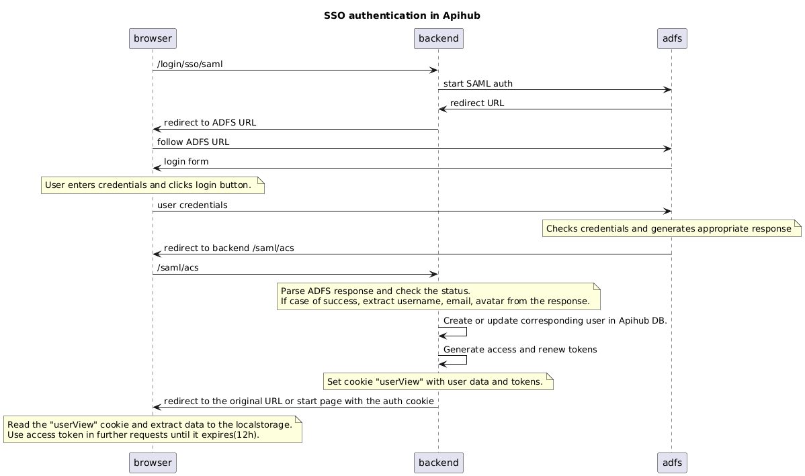

# Authentification
Apihub provides no anonymous access except some dedicated endpoints like shared document or it's own openapi spec.
Apihub supports SSO and local(disabled in production mode) authentication.

SSO is implemented via SAML and tested with ADFS.

## SSO via Saml

Notes:
* Apihub is using external authentication, but issuing it's own Bearer token which is used for all requests to Apihub.
* Attributes "User-Principal-Name", "http://schemas.xmlsoap.org/ws/2005/05/identity/claims/emailaddress" are mandatory in SAML response.
* Attributes "http://schemas.xmlsoap.org/ws/2005/05/identity/claims/givenname", "http://schemas.xmlsoap.org/ws/2005/05/identity/claims/surname", "thumbnailPhoto" are not mandatory, but expected in SAML response to fill the user profile.

## Internal(local) user management
Apihub supports local user management, but this functionality is disabled in production.

TODO: description

## Api keys
TODO

## Personal Access Tokens
TODO

# Authorization
Apihub have built-in authorization model which is based on roles for packages.
User have a set of roles for particular package.
Role have a set of permissions.

Package have a default role.

TODO

