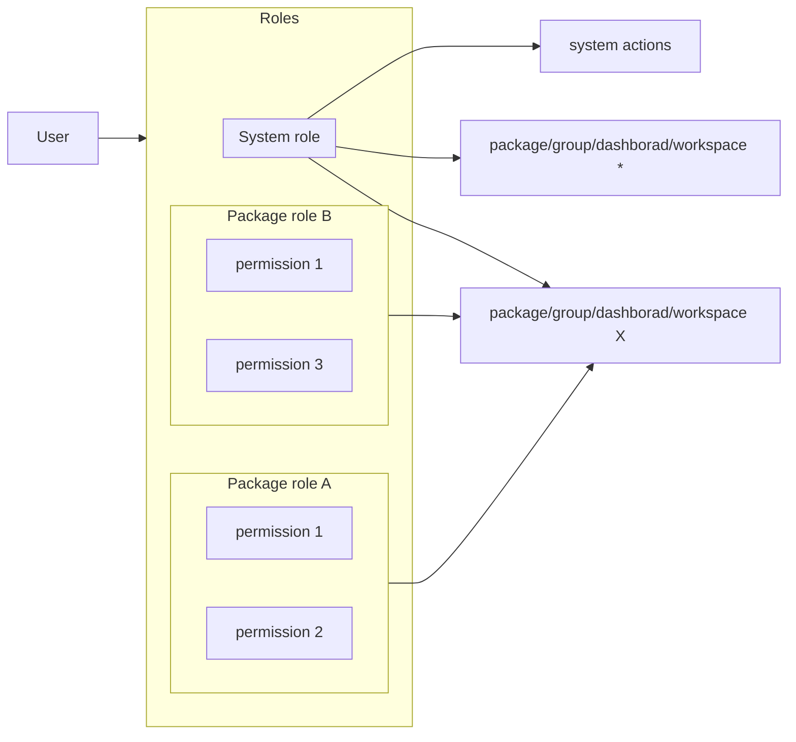

# Authentification
Apihub provides no anonymous access except some dedicated endpoints like shared document or it's own openapi spec.
Apihub supports SSO and local(disabled in production mode) authentication.

At this moment SSO is implemented via SAML and tested with ADFS.

## SSO via Saml

Notes:
* Apihub is using external authentication, but issuing it's own Bearer token which is used for all requests to Apihub.
* Attributes "User-Principal-Name", "http://schemas.xmlsoap.org/ws/2005/05/identity/claims/emailaddress" are mandatory in SAML response.
* Attributes "http://schemas.xmlsoap.org/ws/2005/05/identity/claims/givenname", "http://schemas.xmlsoap.org/ws/2005/05/identity/claims/surname", "thumbnailPhoto" are not mandatory, but expected in SAML response to fill the user profile.

In the result of successful IDP auth, user is synced to Apihub DB and bearer token is generated.
The bearer token is used for authentication/authorization, it should be passed in "Authorization" header for any API calls.
Library https://github.com/shaj13/go-guardian is used on the backend to issue and check JWT tokens.

## Internal(local) user management
Apihub supports local user management, but this functionality is disabled in production.

There's no registration page, but it's possible to create local user via API.
Local login is supported via UI page("/login") and dedicated endpoint ("/api/v2/auth/local").

## Api keys
Api key is another auth method intended for some automation.

Api key is bound to workspace/group/package/dashboard (see Data entities chapter)

TODO

## Personal Access Tokens
TODO

# Authorization
## Data entities
First of all let's define some terms/entities used in the following description.
'Workspace' is a top grouping entity which may contain groups, packages, dashboards.
'Group' is a grouping entity for a list of packages.
'Package' is a representation of a service with API.
'Dashboard' is representation for a set of particulate versions of services, i.e. it's like deployment.

## Roles and permissions

Apihub have built-in authorization model which is based on granted roles for workspace/group/package/dashboard and system roles.

User have a set of roles for particular entity.  
Role have a set of permissions.  
Roles are defined system-wide by system administrators.  
Roles have an hierarchy which limits privilege escalation. 

Permission in required to execute some action like view content, publish version, create package, etc.

Workspace/group/package/dashboard have a default role that is assigned to a user which have no granted role.
Default role for most entities is "Viewer", i.e. read only access.

### Permissions
Permissions are hardcoded, i.e. it's not possible to modify permissions list via configuration.

Available permissions:
* read content of public packages	
* create, update group/package	
* delete group/package	
* manage version in draft status	
* manage version in release status	
* manage version in archived status	
* user access management	
* access token management

### Role management
Built-in roles:
* Viewer - read only role
* Editor - role with an ability to publish new version
* Owner - role with full ability to manage the entity, but without access configuration
* Admin - full access to the entity
* Release Manager - role to manage release versions

It's possible to create a new custom role with any set of permissions

Example:  

It's possible to edit or delete roles other than admin and viewer.

### Permissions configuration

Default permissions configuration:

The roles configuration provides flexibility to create required roles with required set of permissions.

### Roles hierarchy

The roles have an hierarchy which is used in access management.
User may not assign a role higher than his own. (It's not used in defa)

For example:

Default roles Hierarchy:

## System roles
Apihub have a concept of system role - a role which is not bound/limited to workspace/group/package/dashboard entities and works system-wide.
Currently the only built-in system role is "system administrator".

It gives:
* access to all packages with maximum permissions
* access to admin-only actions

## Entity visibility(privacy)
Workspace/group/package/dashboard invisibility(privacy) is implemented via missing read permission.  
System have built-in role "none" which have no permissions at all.
So if the workspace/group/package/dashboard need to be private - the default role should be "none"

In UI it's managed by a "Private" checkbox:  

In this case any user which have no granted roles for the entity, will not be able to see/retrieve it. It's managed on the API level.

The known gap related to privacy is global search: private workspaces/groups/packages/dashboards are excluded from search.